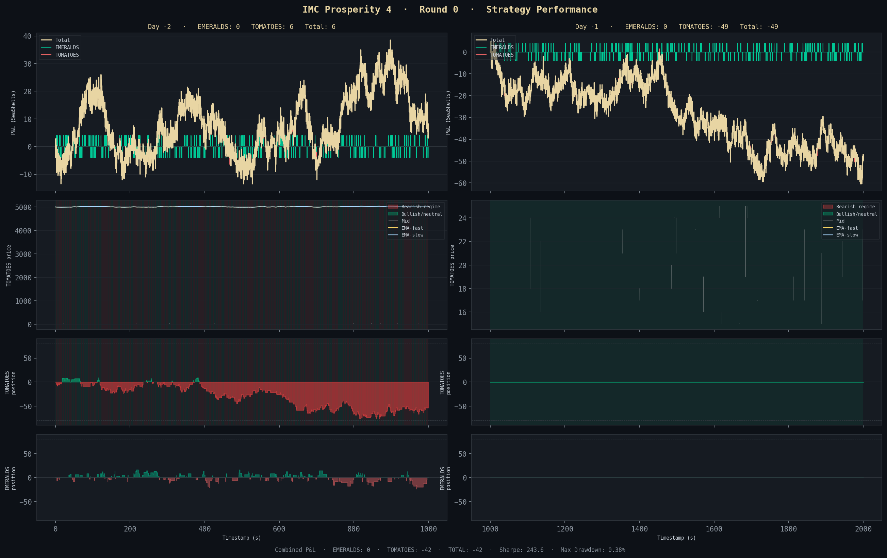

# Team Satoru — IMC Prosperity 4

Algorithmic trading strategy for IMC Prosperity 4, Round 0.

## Strategy Performance



> **Round 0 Combined P&L: 36,454 SeaShells** · Annualized Sharpe: 243.6 · Max Drawdown: 0.38%

| Day | EMERALDS | TOMATOES | Total |
|-----|----------|----------|-------|
| −2  | 8,208    | 9,179    | 17,387 |
| −1  | 8,872    | 10,195   | 19,067 |
| **Combined** | **17,080** | **19,374** | **36,454** |

---

## Products

### EMERALDS — Stoikov Market Maker
EMERALDS has a known, fixed fair value of **10,000** that never moves. Strategy:
1. **Take** — capture any rogue orders crossing FV (free money)
2. **Make** — post passive limit orders 8 ticks from FV (`bid 9992 / ask 10008`), earning 8 ticks per fill

### TOMATOES — Regime-Adaptive Market Maker
TOMATOES prices trend, so pure symmetric quoting suffers adverse selection. Strategy switches mode based on two signals:

- **1-tick momentum** — any single-tick price drop triggers bearish mode
- **EMA crossover** — fast EMA (9-tick) crosses below slow EMA (16-tick)

| Regime | Bid | Ask | Effect |
|--------|-----|-----|--------|
| Bearish | `bid_wall + 1` (deepest) | `best_ask` | Rarely buys, sells every bounce → net short |
| Neutral / Bullish | `best_bid` | `best_ask` | Symmetric L1 market making |

---

## Files

| File | Description |
|------|-------------|
| `backtester.py` | Main trading algorithm (submit to Prosperity platform) |
| `visualize.py` | Generates `strategy_performance.png` from a fresh backtest |

## Usage

```bash
# Run backtest
python3 -m prosperity4bt backtester.py 0

# Regenerate visualization
python3 visualize.py
```

Requires [prosperity4bt](https://github.com/nabayansaha/imc-prosperity-4-backtester):
```bash
pip install prosperity4bt
```
