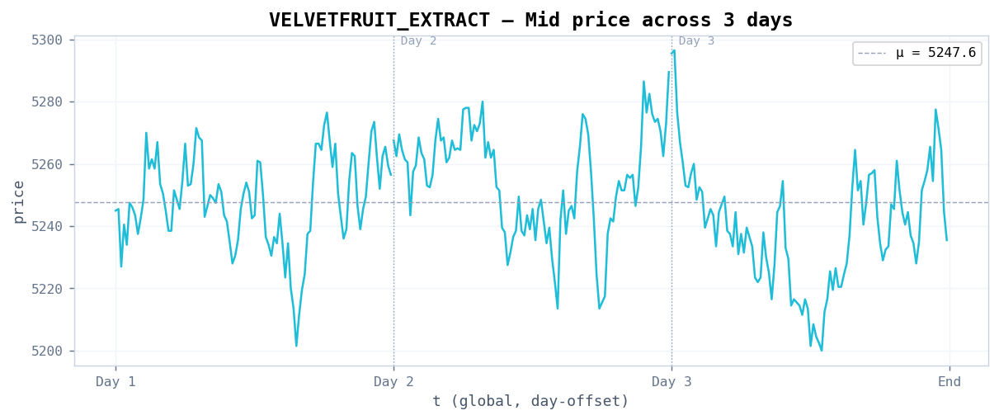
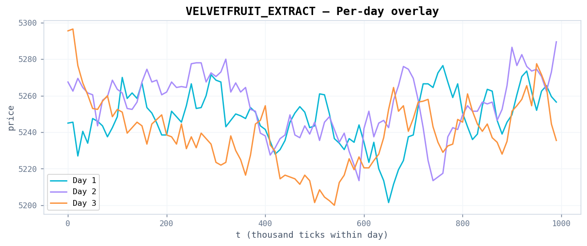
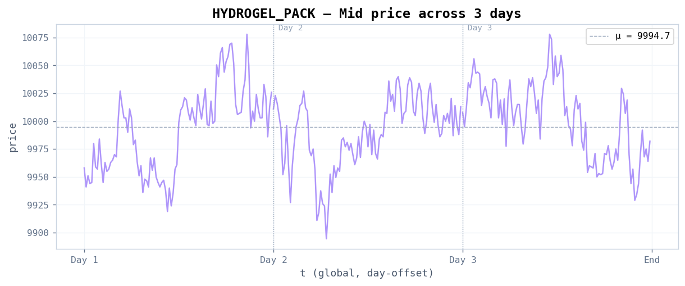
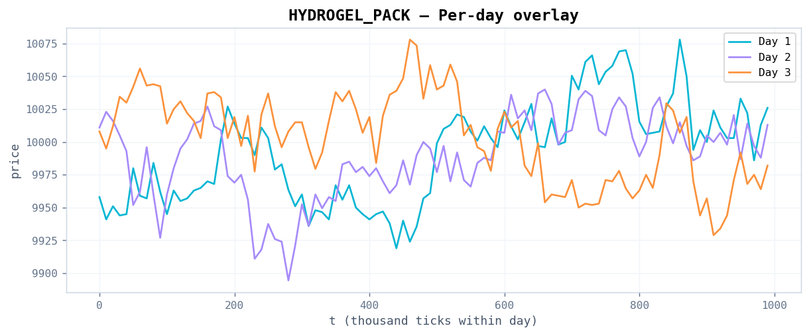
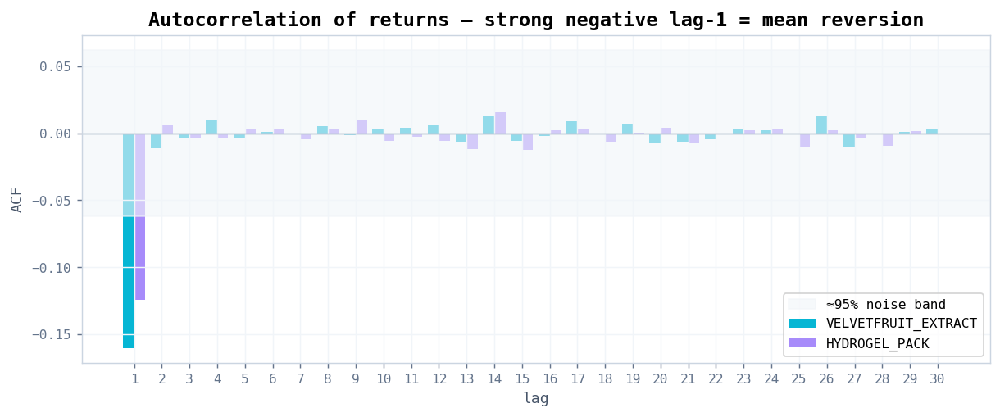
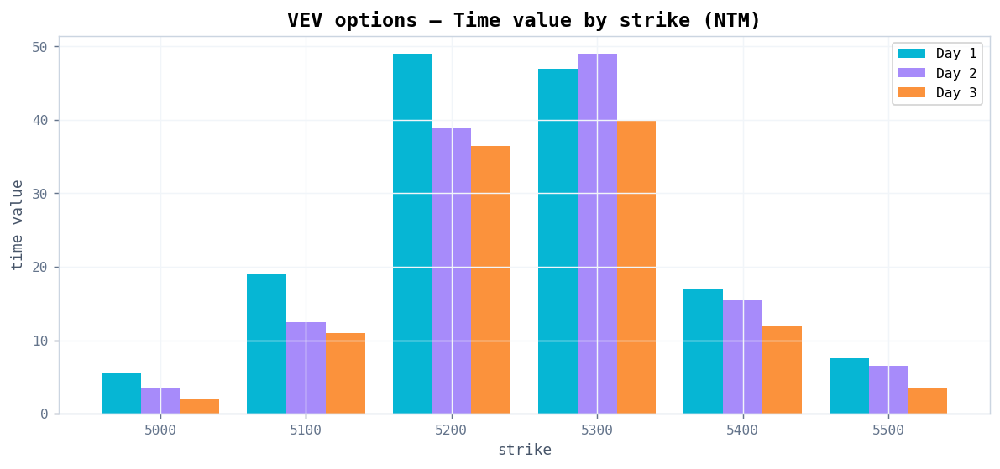
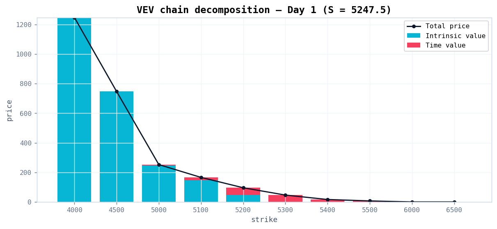
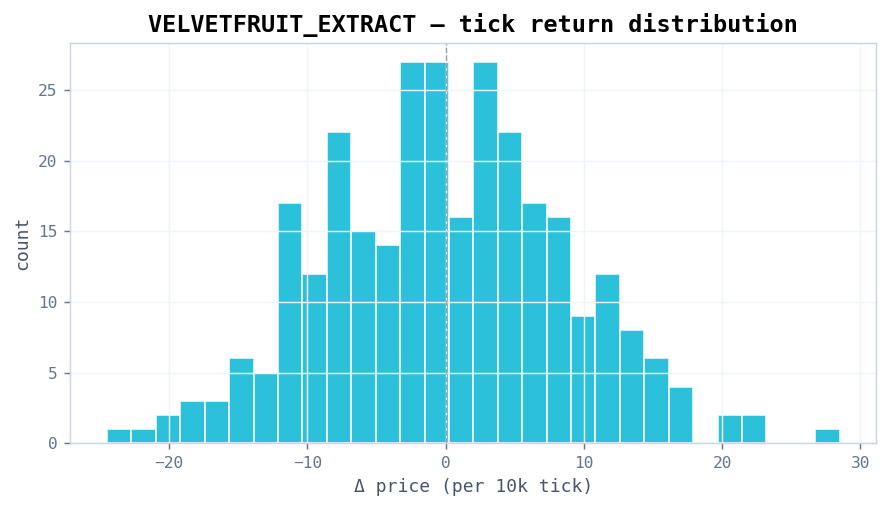
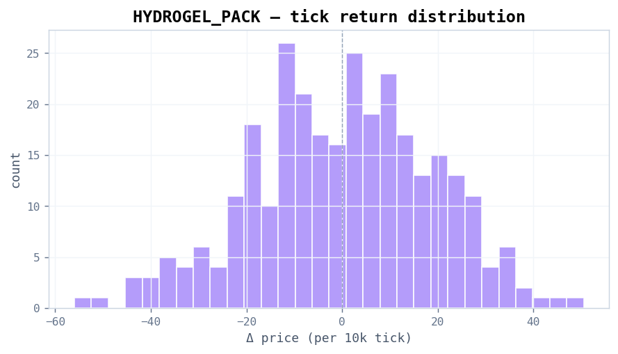
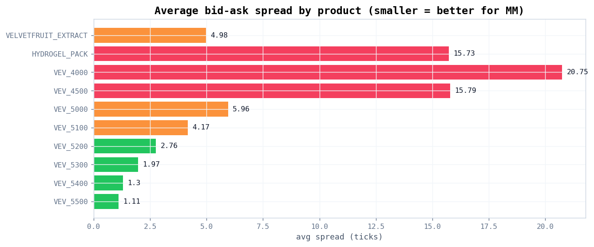

# Prosperity 4 — Round 4 Visuals

Static charts generated from the 10% sample dataset. Source data lives inline in
[`prosperity4_dashboard.jsx`](prosperity4_dashboard.jsx) (the React/Recharts dashboard);
[`generate_charts.py`](generate_charts.py) renders the same panels as PNGs into
[`charts/`](charts/) so the trends are viewable directly on GitHub.

Regenerate with:

```bash
python3 visuals/generate_charts.py
```

---

## 1. Underlying price series

VFE oscillates around 5247.6 across all 3 days; visible regime where Day 3 trends
down through the middle before recovering. HYDROGEL is noisier with a wider band.






## 2. Autocorrelation of returns

Strong negative lag-1 ACF on both products (-0.16 VFE, -0.12 HYDROGEL). All higher
lags fall inside the ≈95% noise band — the mean-reversion signal is purely a
1-tick microstructure effect.



## 3. Options chain

VEV time value peaks at ATM (5200–5300) and decays from Day 1 → Day 3, consistent
with approaching expiry. Deep ITM strikes (4000, 4500) carry near-zero TV and
move 1:1 with VFE.




## 4. Return distributions

Roughly symmetric around 0 — confirms the mean-reverting random-walk character
visible in the ACF.




## 5. Average bid-ask spread by product

Tight spreads (green) are best for market making; wide spreads (red) are ITM
options that effectively trade the underlying.


